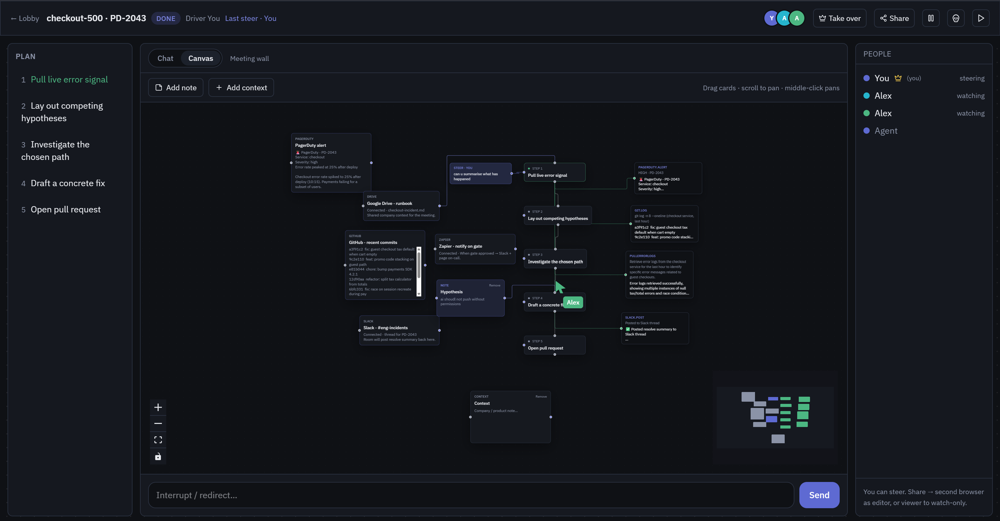
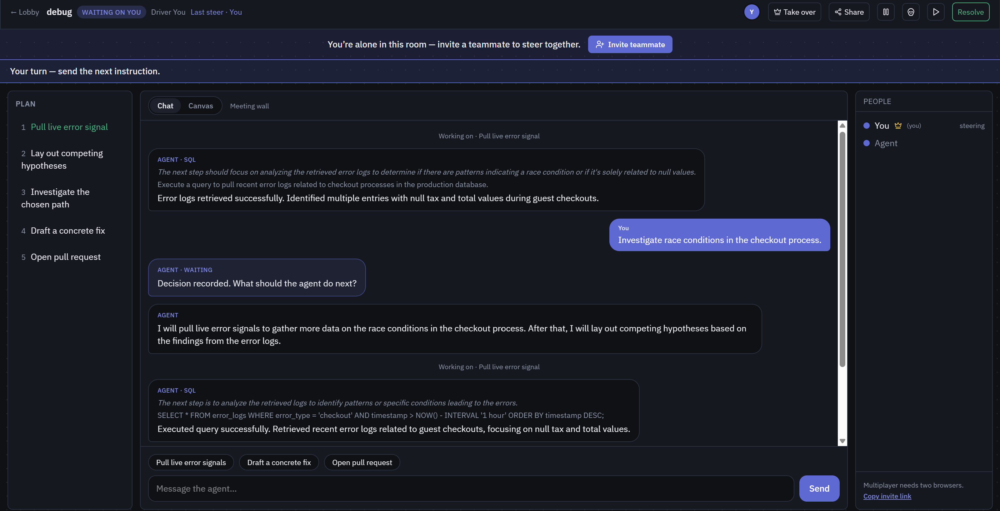
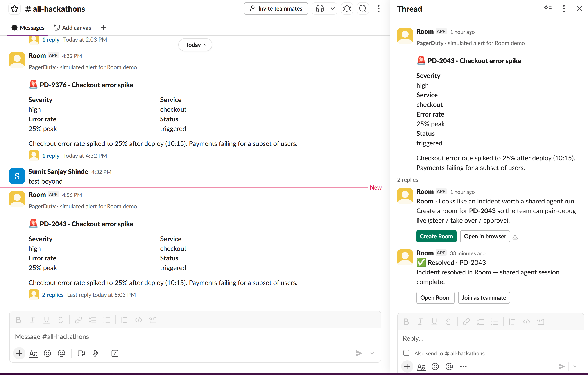
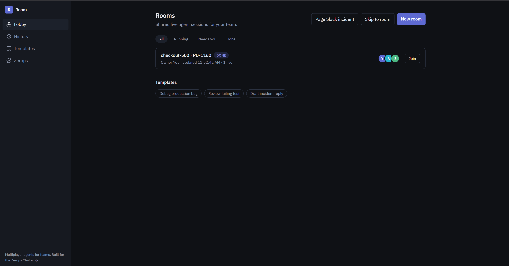
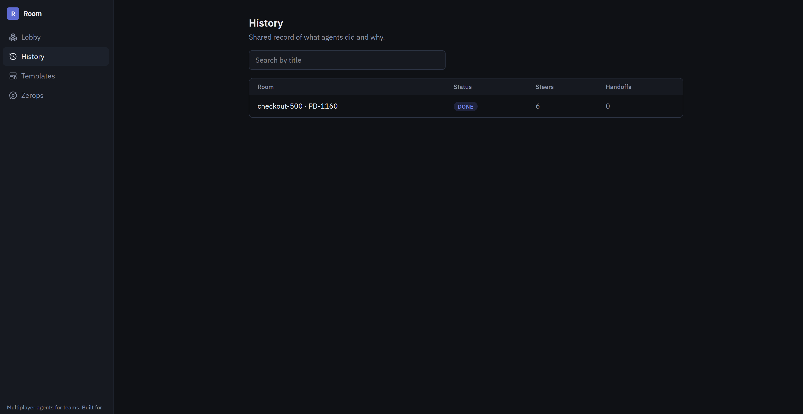

# Room

**Google Docs for agents.** Multiplayer-by-default live agent sessions — teammates join the same run, watch tools stream, steer mid-flight, take over, approve gates, and resume from checkpoints.

Built for [The Zerops Challenge](https://www.wemakedevs.org/hackathons/zerops). Aimed at [YC’s Multiplayer AI](https://www.ycombinator.com/rfs) thesis.

Live: [https://api-20a-4000.ny1.zerops.app](https://api-20a-4000.ny1.zerops.app) · Deploy: [`zerops.yaml`](./zerops.yaml) · Demo script: [DEMO.md](./DEMO.md) · Product rules: [AGENTS.md](./AGENTS.md)

<p align="center">
  
</p>
<p align="center"><em>Canvas — incident context (PagerDuty, Slack, GitHub, Drive) connected to the live agent plan</em></p>

<p align="center">
  
  &nbsp;
  
</p>
<p align="center"><em>Chat — steer the agent mid-run &nbsp;·&nbsp; Slack — PagerDuty alert → Create Room in-thread</em></p>

<p align="center">
  
  &nbsp;
  
</p>
<p align="center"><em>Lobby — find and join live rooms &nbsp;·&nbsp; History — steers, handoffs, how the run resolved</em></p>

---

## Problem

Engineering agents today are **single-player**. One person starts a long run in ChatGPT / Cursor / a bot. Everyone else gets a screenshot, a Slack paste, or “wait until it’s done.”

When the agent goes wrong mid-flight — wrong hypothesis, about to open a noisy PR, needs a human gate — only the person at the keyboard can redirect it. Teammates cannot **change** the run. They can only watch a recording later, if there is one.

### Impact of the problem

- **Lost time** — parallel debugging becomes serial: “I’ll run the agent, you wait.”
- **Lost context** — company rules, runbooks, commits, and PagerDuty live in different tabs; the agent and the room never share one surface.
- **Brittle handoffs** — ownership is “who has the laptop,” not a first-class session primitive.
- **Trust gap** — teams won’t let agents act (merge, page, post) without shared visibility and approve/reject.

ChatGPT is Word 2003. Teams already work like Docs. Agents still don’t.

---

## Solution

**Room** is a shared live session URL (`/r/:id`) where humans and an agent occupy the same meeting surface:

| Capability | What it means |
|------------|----------------|
| **Presence** | See who’s in the room |
| **Live steps / tools** | Both browsers stream the same tool calls |
| **Steer** | Anyone (with edit) redirects the plan mid-run |
| **Take over** | Ownership moves; agent waits on the new driver |
| **Gates** | Approve / reject visible to everyone |
| **Kill + resume** | Checkpoint, then continue |
| **Canvas** | Miro-like board: context, brainstorm notes, integrations, agent plan as connected nodes |
| **Chat** | Steer thread when you want the linear view |

Integrations (Slack, Drive, Zapier, PagerDuty, GitHub) show up as **context on the canvas** so the room pulls shared sources of truth into one place — not a private chat scroll.

### Impact of the solution

- **True multiplayer** — if B cannot change the run, it is not multiplayer. Room makes steer / handoff / gate the demo.
- **Shared context** — incident brief, commits, channel, runbook land once; both people see the same board.
- **Faster decisions** — pick a hypothesis on the canvas, steer the agent, approve the gate together.
- **YC-shaped** — multiplayer AI isn’t “two people using ChatGPT.” It’s one living session with co-ownership.

---

## Why it’s good

1. **Product clarity** — Docs for agents, not another chat clone or sticky-board toy.
2. **Demo-proof multiplayer** — two browsers, one room: presence, live tools, steer, take over, gate, resume.
3. **Meeting-room metaphor** — Chat for talk; Canvas for the wall (context + notes + agent flow).
4. **Integrations as context** — Slack / Drive / Zapier / PagerDuty / GitHub as cards you can connect into the run.
5. **Built to ship on Zerops** — multi-service topology (api + worker + web), private networking, real deploy path — not a static site with a story.

---

## How we use Zerops

Room is a **multi-service** app on Zerops (see [`zerops.yaml`](./zerops.yaml)):

| Service | Role |
|---------|------|
| **api** | Public HTTP + WebSocket; serves the built web UI (`SERVE_WEB=true`) |
| **worker** | Private agent runner; polls jobs, emits `step.*` / gate / plan events |
| *(optional)* | Postgres + Valkey for persistence / presence at scale |

- Build & run defined in `zerops.yaml` (Node, Ubuntu build for Vite native deps).
- Worker talks to API over the **project private network** (`API_URL=http://api:4000`).
- Public URL stays up for judging; source stays reviewable.

Topology (also on [`/about`](./apps/web/src/pages/AboutPage.tsx)):

```text
Public:  web (Vite) ──► api (HTTP + WebSocket)
Private: worker ◄──► api · db (Postgres) · cache (Valkey)
```

Manual deploy: `zcli push` (or Zerops GUI). Config lives in the repo — no “host a static site only.”

---

## How we use AI

AI **assisted**; architecture and product decisions stayed human-owned (Zerops challenge policy).

| Use | How |
|-----|-----|
| **Coding agent (Cursor)** | Vertical slices: room WS events, canvas (React Flow), Slack demo path, Zerops config |
| **Scripted / LLM agent worker** | Demo agent emits realistic steps + tools; optional `OPENAI_API_KEY` for richer replies |
| **Design skill** | Taste-oriented frontend guidance (avoid generic purple AI SaaS) |

We disclose tools for the submission form; nothing is a black box we can’t explain.

---

## How I built it (and what I learned)

### Build path

1. Locked the product in [AGENTS.md](./AGENTS.md): multiplayer proof first, routes fixed, no Miro-stickies-as-product.
2. Shipped a thin vertical slice: create room → WS events → steer / gate / handoff / checkpoint.
3. Worker as a separate Zerops service so the agent isn’t glued inside the HTTP process.
4. Evolved `/r/:id` from chat-only → **Chat | Canvas** meeting wall (context, brainstorm, plan nodes, mock integrations).
5. Wired Slack incident → shared brief → Room as the recording path for the demo.

### What I learned

- **Multiplayer is a verb.** Streaming tokens to two tabs isn’t enough — steer and ownership must mutate shared state.
- **Context beats prompts.** Putting PagerDuty / commits / Slack / Drive on one canvas changes how people decide with the agent.
- **Separate worker pays off.** Cleaner demos, clearer Zerops story, fewer “is the API blocked on the agent?” bugs.
- **AI is leverage, not authorship.** Fast iteration on UI and glue; the thesis (Docs for agents) and the event model had to be deliberate.

---

## Stack

| Piece | Tech |
|-------|------|
| UI | Vite · React · TypeScript · Tailwind · React Flow (canvas) |
| API | Express · WebSocket |
| Worker | Node job poller → room events |
| Deploy | Zerops (`api` + `worker`) |

MVP room state can live in-memory on the API; Postgres / Valkey are the scale path on Zerops.

---

## Local dev

```bash
npm install
npm run dev
```

Starts **api + worker + web**. Open http://localhost:5173

Copy `.env.example` → `.env`. Optional: `OPENAI_API_KEY` for the worker.

---

## Demo

Follow [DEMO.md](./DEMO.md): landing → room → second browser joins → live tool → steer → take over / gate → kill → resume → “YC asked for multiplayer AI. This is it — on Zerops.”

---

## Links

- Challenge: https://www.wemakedevs.org/hackathons/zerops  
- YC Multiplayer AI: https://www.ycombinator.com/rfs  
- Submission notes: [SUBMISSION.md](./SUBMISSION.md)

---

## Demo video

<p align="center">
  <a href="https://youtu.be/RmKHUzReEoI">
    
  </a>
</p>

<p align="center"><a href="https://youtu.be/RmKHUzReEoI"><strong>Watch the demo →</strong></a></p>
